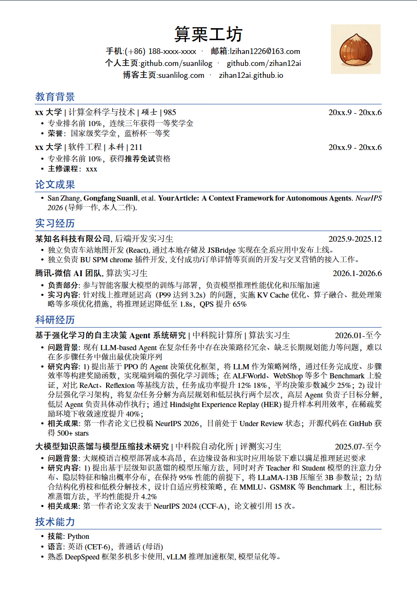

# 通用的简历LaTeX模板

一个专为应届毕业生设计的专业求职简历LaTeX模板，适用于各类求职申请、学术申请和奖学金申请。

---

## 📋 项目特点

- ✨ **专业美观**：采用简洁大方的学术风格，突出个人优势
- 🎨 **中英文支持**：完美支持中英文混合排版，字体显示清晰
- 🚀 **易于使用**：只需修改个人信息即可生成专业简历
- 📱 **响应式设计**：自动适应不同打印和屏幕显示需求

## 📸 效果展示



*生成的简历效果示例*

## 🚀 快速开始

### 1. 环境要求

- **LaTeX编译器**：推荐使用 **XeLaTeX** 或 **LuaLaTeX**
- **字体支持**：模板已内置中文字体支持
- **推荐编辑器**：TeXstudio、VS Code + LaTeX Workshop、USTC Overleaf(直接下载Zip，上传项目即可)

### 2. 编译步骤

```bash
# 使用XeLaTeX编译（推荐）
xelatex resume.tex
```

**注意**：由于使用了中文字体，请确保使用XeLaTeX或LuaLaTeX进行编译，不要使用传统的pdfLaTeX。

## 📁 项目结构

```
USTC_Resume/
├── resume.tex          # 主文件，包含简历内容
├── cls/
│   └── resume.cls      # 简历样式类文件
├── sty/
│   ├── linespacing_fix.sty      # 行距修复
│   └── zh_CN-Adobefonts_external.sty  # 中文字体支持
├── fonts/              # 字体目录（无需手动处理）
├── image/              # 图片目录
│   └── suanligongfang.png          # 证件照
├── readme_image/
│   └── example.png                 # 示例图片
└── readme.md           # 项目说明文档
```

## 🖼️ 图片自定义

将您的证件照替换到 `image/identification_photo.jpeg`，支持以下格式：
- JPEG/JPG
- PNG
- PDF

## 📝 简历内容结构

模板包含以下主要模块：

1. **个人信息** - 姓名、联系方式等
2. **教育背景** - 本科、硕士、博士学习经历
3. **论文发表** - 学术论文、会议论文等
4. **实习经历** - 企业实习、项目经验
5. **科研经历** - 科研项目、学术成果
6. **技术能力** - 编程语言、工具技能、语言能力

## 📋 注意事项

1. **编译环境**：必须使用XeLaTeX或LuaLaTeX编译
2. **字体问题**：如果出现字体缺失，请确保完整下载了fonts目录
3. **图片路径**：图片文件请放置在image目录下
4. **版本兼容**：建议使用LaTeX发行版版本2020或更高版本

## 🙏 致谢

- 感谢开源社区对LaTeX生态的贡献：[hijiangtao/resume](https://github.com/hijiangtao/resume)
  
---


**关键词**：简历, resume, CV, LLM, Agent, Infra, 算法, 开发, 后端, 求职, LaTeX, 简历模板, 学术简历, 求职申请, 硕士简历, 本科简历, 科研简历, 实习简历
